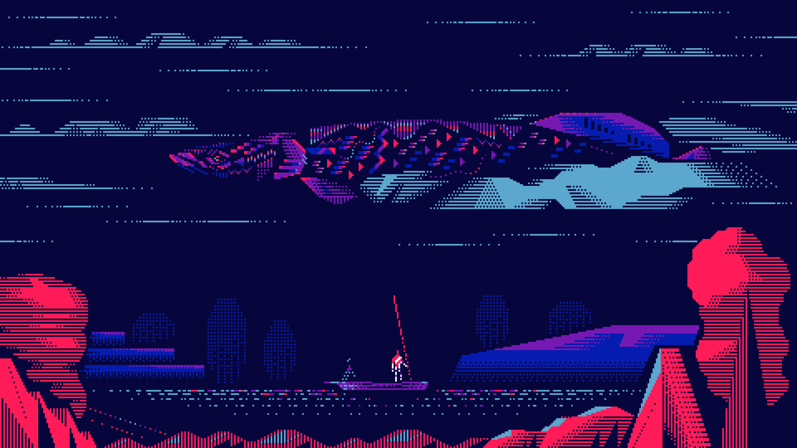
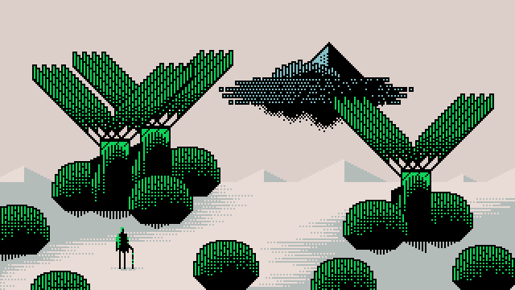

# Konnichiwa 👋

<!-- pattern:Blueberry -->

 

|                                                              Activity                                                               |                                     Most Used Languages                                      |
| :---------------------------------------------------------------------------------------------------------------------------------: | :------------------------------------------------------------------------------------------: |
|  |  |

<!-- pattern:Green -->
<!-- 

 

|                                                           Activity                                                            |                                  Most Used Languages                                   |
| :---------------------------------------------------------------------------------------------------------------------------: | :------------------------------------------------------------------------------------: |
|  |  |

 -->

<!--
**mst-nsh/mst-nsh** is a ✨ _special_ ✨ repository because its `README.md` (this file) appears on your GitHub profile.

Here are some ideas to get you started:

- 🔭 I’m currently working on ...
- 🌱 I’m currently learning ...
- 👯 I’m looking to collaborate on ...
- 🤔 I’m looking for help with ...
- 💬 Ask me about ...
- 📫 How to reach me: ...
- 😄 Pronouns: ...
- ⚡ Fun fact: ...
-->
